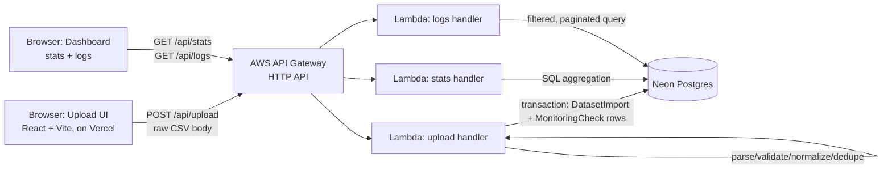

# SLA Monitoring Dashboard

An SLA monitoring dashboard for health-check logs: upload a CSV of per-service health checks,
have it parsed/validated/cleaned by a real deployed serverless function, persisted to Postgres,
and viewed on a single-screen dashboard (collapsible availability stats + a filterable, paginated
log table).

**Live app:** https://sla-monitoring-dashboard-omega.vercel.app
**Live API:** https://nddeqm13al.execute-api.us-east-1.amazonaws.com
**Repo:** https://github.com/roshnithakor07/sla-monitoring-dashboard

Last verified live: 2026-09-18 (see [§9 Redeployment](#9-redeployment) if it's down when you read this).

---

## 1. Overview

Cloud SLAs ("99.9% availability or you get a credit") are computed automatically from monitoring
data, so the pipeline that turns raw check logs into a number has to be trustworthy and
inspectable. This app is that pipeline end to end:

1. A user uploads a CSV of health checks (5 services, one check every 15 minutes, multiple
   agents/days) through a browser.
2. The file is sent to a deployed AWS Lambda, which parses, validates, normalizes, and
   deduplicates it.
3. Cleaned rows are persisted to Postgres — the Lambda holds nothing in memory between requests.
4. The dashboard queries that persisted data (never the raw upload) to render availability
   statistics and a filterable log table.

## 2. Architecture



**What runs where:**

| Layer | Runs on | Notes |
|---|---|---|
| Upload/dashboard UI | Vercel (static hosting) | React + Vite SPA, no server-side rendering needed |
| `/api/upload`, `/api/stats`, `/api/logs` | AWS Lambda (Node.js 20.x) behind API Gateway HTTP API | Three independent, stateless functions, one per route |
| Database | Neon (serverless Postgres) | Reachable from anywhere with the connection string; not colocated with the Lambda |

The Lambda is genuinely stateless: nothing about one request affects the next. An upload's only
side effect is rows in Postgres; the dashboard endpoints only ever read from Postgres, never from
anything the upload handler kept in memory.

## 3. Technology choices

- **React + TypeScript + Vite, not Next.js** — this is a single-screen SPA with no routing, no
  SSR/SEO need, and a separately-deployed API; Next.js's extra machinery (file-based routing, its
  own API-route/serverless model that would compete with the Lambda) buys nothing here. Vite's
  dev server and build are simpler to reason about for a dashboard this size.
- **Tailwind CSS** — utility classes kept styling co-located with markup without a separate
  component library dependency, appropriate for a handful of components.
- **AWS Lambda + API Gateway (HTTP API, not REST API)** — HTTP API is cheaper, lower-latency, and
  simpler to configure than a REST API when you don't need the REST API's request
  validation/transformation features, which this project doesn't. Deployed via the **Serverless
  Framework (v3)** rather than hand-written CloudFormation or the AWS CLI: one `serverless.yml`
  declares all three functions, their routes, and CORS, and `serverless deploy` handles zipping,
  S3 upload, and the CloudFormation stack. (v3, not v4, deliberately — v4 requires a Serverless
  Framework account login for a feature unrelated to this project.)
- **No Express** — three small handlers each implementing `(APIGatewayProxyEventV2) => Promise<...>`
  directly is simpler than routing through an Express app adapter for three routes; Express would
  be pure overhead here.
- **PostgreSQL + Prisma, hosted on Neon** — Postgres because the workload is exactly what
  relational aggregation is good at (COUNT/AVG/PERCENTILE_CONT with WHERE clauses over indexed
  columns). Prisma for a type-safe schema/migration workflow and because raw SQL is still
  available (via `$queryRaw` with tagged-template parameterization) for the aggregate queries
  Prisma's query builder doesn't express well (percentiles). Neon specifically: serverless
  Postgres with a real free tier, no credit card, and a connection string reachable from Lambda
  without VPC configuration.
- **Zod** for query-parameter and structural validation — small, and the same library validates
  both `/api/stats`/`/api/logs` query params and could validate CSV rows if the source format
  changes; used narrowly rather than for everything, to avoid over-abstracting simple checks.
- **csv-parse** for CSV parsing (not a hand-rolled splitter) — handles quoting/escaping/CRLF
  correctly, which hand-rolled `split(',')` does not; version pinned to `^7.0.2` specifically
  because `npm audit` flagged a prototype-pollution advisory in the `5.x` line for the `columns`
  option, which this project uses on untrusted uploaded input.
- **No charting library** — `recharts` was installed, then removed once it became clear the stat
  tiles + per-service table already communicate magnitude and comparison clearly for 5 services;
  adding a categorical chart would need a full accessible-palette validation pass (see the
  `dataviz` skill this session used to make that call) for marginal benefit at this scale.

## 4. Data findings

Every dataset was inspected directly (not assumed) with a Node profiling script before any
cleaning logic was written, then re-verified by actually running the final pipeline against all 5
real files. Numbers below are from that real run, not estimates.

| File | Days | Total rows | Accepted | Rejected | Duplicates removed |
|---|---|---|---|---|---|
| `monitoring_checks_9d_seed101.csv` | 9 | 4,672 | 4,665 | 0 | 7 |
| `monitoring_checks_12d_seed505.csv` | 12 | 6,230 | 6,220 | 0 | 10 |
| `monitoring_checks_14d_seed202.csv` | 14 | 7,269 | 7,257 | 0 | 12 |
| `monitoring_checks_21d_seed303.csv` | 21 | 10,904 | 10,886 | 0 | 18 |
| `monitoring_checks_30d_seed404.csv` | 30 | 15,577 | 15,552 | 0 | 25 |
| **Total** | | **44,652** | **44,580** | **0** | **72** |

Of the 44,580 accepted rows: 44,039 are fully clean, 531 have missing latency, 5 have invalid
(negative) latency, and 5 have an invalid status code — every one of those last two is exactly 1
per file, which is a strong signal these were deliberately injected test cases rather than organic
noise.

**Every issue found, and how it was handled:**

1. **Status code 999 (invalid HTTP status), exactly 1 per file, 5 total.** 999 is not a standard
   HTTP status. *Handled:* row is **preserved with a flag** (`dataQualityStatus = INVALID_STATUS`),
   never remapped to 500/503 and never counted as successful. Excluded from both the numerator and
   denominator of the availability calculation (§5) — we genuinely don't know if the underlying
   check passed or failed.
2. **Negative latency, exactly 1 per file, 5 total** (e.g. `-296`). Physically impossible.
   *Handled:* **preserved with a flag** (`LATENCY_INVALID`), `latencyMs` stored as `null`. The
   check's status code is still trustworthy, so it still counts toward availability; it's only
   excluded from latency averages/percentiles.
3. **Missing latency, 531 rows (~1.2%).** Blank `latency` field. *Handled:* same as above —
   **preserved with a flag** (`LATENCY_MISSING`), excluded only from latency aggregates, not from
   availability.
4. **Three timestamp formats mixed in every file:** ISO 8601 with `Z` (~97%), ISO 8601 with an
   explicit offset like `+05:30` (~0.7%), and Unix epoch-seconds as a plain numeric string
   (~1.4%). *Handled:* **normalized** to UTC (`Date.UTC`-based parsing, not string manipulation
   that could pick up the server's local timezone). Zero timestamps in the supplied data were
   genuinely unparseable, but the pipeline still has a reject path for one, exercised by tests.
5. **Full exact-duplicate rows** (identical `service_id`+`timestamp`+`status_code`+`latency`+
   `latency_unit`+`agent`+`region`): found in every file. *Handled:* **deduplicated**, keeping the
   first occurrence.
6. **A subtler duplicate: the same check recorded twice with two different timestamp
   representations of the same instant** — e.g. one row as `2025-04-19T12:15:00Z` and another as
   the equivalent Unix-epoch string `1745064900`, same service, same agent. Found by grouping on
   the *normalized* timestamp rather than the raw string; a naive raw-string dedup would have
   missed these (verified directly against the 12-day file, where this pattern accounts for the
   gap between "duplicate rows by raw timestamp" and "duplicate rows by normalized timestamp").
   *Handled:* same dedup path as #5, since after normalization these keys collide.
7. **A rare conflicting-duplicate case (2 rows total, both in the 14-day file):** same
   `service_id`+`timestamp`+`agent`, but one copy has a latency value and the paired copy is
   blank. *Handled:* deterministic tie-break — **prefer the row with a non-null latency** over the
   blank one (it carries strictly more information); ties beyond that fall back to file order.
8. **Legitimate multi-agent observations** (same `service_id`+`timestamp`, *different* `agent`):
   hundreds to over a thousand per file. Investigated specifically because the assignment warned
   against assuming these are corruption. *Handled:* **both rows preserved**, not deduplicated —
   two agents independently checking the same service at the same 15-minute mark are two real
   observations, and both are counted separately in availability.
9. **`region` is a single constant value** (`ap-south-1`) across every row in every file — no
   actual regional diversity was present despite the checklist prompting to look for it. Stored
   as-is; no special handling needed because there was nothing to handle.
10. **`service_id` ↔ `service_name` mapping is perfectly 1:1 and consistent** across all 5 files
    (`svc-auth`/`auth-api`, `svc-search`/`search-api`, `svc-payments`/`payments-api`,
    `svc-notify`/`notify-worker`, `svc-reports`/`reports-api`) — no typos or casing variants found.
    Validated against a fixed enum anyway (defensively reject anything else) rather than trusting
    the input.
11. **15-minute check-interval grid is perfectly dense** — every service in every file has exactly
    one distinct timestamp per 15-minute slot from its first to last check, with zero gaps
    (slot counts match `days × 96` exactly in every file). No missing-check imputation was needed.
12. **`latency_unit` is only ever `ms` or `s`**, no unrecognized units found; `s`-unit values, once
    converted, land in the same broad magnitude range as `ms`-unit values (hundreds of ms),
    confirming they're a legitimate alternate unit rather than misplaced/garbage data.
13. **The 5 sample files have overlapping date ranges and are independently seeded** — the 12-day
    (starts 2025-04-10), 21-day (starts 2025-04-03), and 30-day (starts 2025-04-06) files all cover
    mid-to-late April simultaneously. Loading all 5 into one database (done for this demo, to have
    a realistic data volume) means the same `service_id + timestamp + agent` key legitimately
    appears more than once with *different* latency/status values across files — verified directly
    by querying the live database: of 8,758 colliding keys, 8,743 had genuinely different payloads.
    This was discovered while investigating whether re-uploads should be deduplicated at the row
    level (§5) — a key-based or even full-row-content constraint would have silently discarded real
    data from a later file just because it collided with an earlier one.

## 5. Assumptions

Documented here because the spec explicitly said not to make silent choices.

- **Availability formula:** `successfulChecks / validChecks × 100`, where `validChecks` = all
  persisted checks **excluding** `INVALID_STATUS` rows, and `successfulChecks` = valid checks with
  a 2xx status code. Rejected-at-parse rows (never persisted) are never counted anywhere.
- **What counts as "successful":** exactly 2xx. Any other standard HTTP code (3xx/4xx/5xx) counts
  as a valid-but-failed check.
- **999 / invalid status codes:** excluded from **both** the numerator and denominator — not
  treated as success, and not treated as a normal failure either, because we can't actually
  classify it. Documented in the UI as a distinct "invalid" state (grey badge), never colored as
  pass or fail.
- **Missing/negative latency's effect on availability:** none — a check's status code is
  independent of whether its latency was recorded correctly, so these rows still count toward
  availability. They're excluded only from `avgLatencyMs`/`p95LatencyMs`.
- **Duplicate handling within a file:** exact duplicates (same service+timestamp+agent+payload) are
  deduped to one row; conflicting duplicates prefer the row with a non-null latency; multi-agent
  observations (same service+timestamp, different agent) are never deduped against each other. See
  §4 items 5-8 for the evidence behind each of these.
- **Re-uploading the same file:** detected and rejected at the whole-file level — the raw CSV's
  SHA-256 is stored on `DatasetImport.contentHash` (unique), and re-submitting a file whose content
  already matches a previous import returns `acceptedRows: 0` / `duplicateRows: totalRows` /
  `duplicateOfImport: {filename, uploadedAt}` without persisting anything a second time.
- **Cross-upload row-level dedup was tried and deliberately reverted.** An earlier version of this
  pipeline enforced a database-level unique constraint on (serviceId, timestamp, agent) across
  *all* uploads, on the theory that a re-submitted check shouldn't be counted twice. Verifying that
  against the actual data before shipping it found the constraint was wrong for this dataset: the 5
  supplied sample files have **overlapping date ranges** (e.g. the 12-day, 21-day, and 30-day files
  all cover mid-April) and were **independently seeded**, so the same (serviceId, timestamp, agent)
  key legitimately carries *different* latency/status values across files — confirmed directly: of
  8,758 colliding keys, only 15 were true full-row duplicates; 8,743 had genuinely different
  payloads from different files. A key-only constraint would have silently discarded real data;
  even a full-row-content constraint still found 120 coincidental cross-file matches that were
  provably two different observations. Row-level identity isn't a safe way to detect "already
  uploaded" for this dataset — whole-file content hashing is.
- **Multi-agent observations' effect on availability:** counted as independent checks, not
  collapsed to one "consensus" result per timestamp — an alternative design (e.g. treating a
  service+timestamp as failed if *any* agent saw a failure) would materially change the
  availability number and wasn't clearly what the data intended, so the simpler, more literal
  "every persisted row is one check" interpretation was used.
- **SLA threshold:** 99.9%, taken directly from the case study's background text. This is shown as
  a labeled *reference threshold* against the measured availability, not presented as a real
  per-service contractual SLA — the assignment doesn't supply one.
- **Date filtering:** a single date covers that entire UTC calendar day
  (`[00:00:00.000Z, 23:59:59.999Z]`); a range covers the start of the first date through the end
  of the last, inclusive. Built via `Date.UTC(...)`, deliberately avoiding any `Date` parsing path
  that could be reinterpreted in the server's local timezone.
- **Incident log (`dataset_incident_log.json`):** treated as **reference/documentation only**
  (this README, §4/§9), not imported into the database or surfaced in the UI. It names known
  incident windows per seed file, which is useful context for *why* a given time range shows a
  cluster of failures when you're reading the logs table — but it's metadata about how the fixture
  data was generated, not something the monitoring pipeline itself discovered, so mixing it into
  calculated stats would blur "what we measured" with "what we were told." This is one of the
  explicitly-allowed options in the spec ("or simply documented as supporting information").
- **Row-level rejection vs flagging:** a row is only fully rejected (never persisted) if it's
  structurally unusable — a required field is blank, the service is unrecognized, or the
  timestamp can't be parsed at all. Everything else (bad status, bad latency) is persisted with a
  flag instead, per the spec's explicit instruction not to blindly delete messy records.

## 6. Local setup

Requires Node.js 20+ and a Postgres database (Neon recommended — free, no local install).

```bash
git clone https://github.com/roshnithakor07/sla-monitoring-dashboard.git
cd sla-monitoring-dashboard

# Backend
cd backend
npm install
cp .env.example .env   # fill in DATABASE_URL (+ DIRECT_URL if using Neon's pooled connection)
npx prisma migrate deploy   # creates MonitoringCheck / DatasetImport tables
npm run dev             # local stand-in for API Gateway at http://localhost:3001

# Frontend (separate terminal)
cd ../frontend
npm install
echo 'VITE_API_BASE_URL="http://localhost:3001"' > .env
npm run dev              # http://localhost:5173
```

**Environment variables:**

| Var | Where | Purpose |
|---|---|---|
| `DATABASE_URL` | `backend/.env` | Runtime Postgres connection (pooled, if using Neon's pgbouncer endpoint) |
| `DIRECT_URL` | `backend/.env` | Direct (unpooled) connection, used only for `prisma migrate` |
| `MAX_UPLOAD_BYTES` | `backend/.env` | Defensive upload size cap (default 5MB) |
| `VITE_API_BASE_URL` | `frontend/.env` | Base URL the frontend calls — local dev server or the deployed API Gateway URL |

**Running the tests:** `cd backend && npm test` — 37 tests covering timestamp normalization, epoch
parsing, timezone conversion, latency conversion, negative-latency rejection, status
classification, dedup (including the cross-format case), and availability math, plus an
integration test that runs the real upload handler against the real database (and cleans up its
own rows afterward).

**Testing the Lambda locally:** `backend/src/local/server.ts` is a thin `node:http` adapter that
converts a plain HTTP request into the exact `APIGatewayProxyEventV2` shape the deployed Lambda
receives, and calls the same handler functions — so `npm run dev` exercises real production code
paths, not a parallel reimplementation. It is **not** part of the deployed architecture; it exists
purely so the frontend has something to talk to during local development.

## 7. Deployment

**Frontend (Vercel):**

```bash
cd frontend
npx vercel@latest login
npx vercel@latest link         # first time only
npx vercel@latest env add VITE_API_BASE_URL production   # paste the API Gateway URL
npx vercel@latest --prod
```

**Backend (AWS Lambda + API Gateway, via Serverless Framework v3):**

```bash
cd backend
npm install
npx prisma generate            # generates the Lambda-compatible (rhel-openssl-3.0.x) engine too
npm run build                  # tsc -> dist/
set -a && source .env && set +a   # exports DATABASE_URL/DIRECT_URL for serverless.yml
npx serverless@3 deploy
```

This creates one CloudFormation stack (`sla-monitoring-backend-dev`) containing 3 Lambda functions,
an HTTP API Gateway with CORS enabled, an IAM execution role, CloudWatch log groups, and an S3
bucket for deployment artifacts — all AWS free-tier eligible at this traffic volume (Lambda: 1M
free requests/month; API Gateway HTTP API: 1M free requests/month for 12 months; S3/CloudWatch:
negligible at this scale). No EC2, RDS, or NAT Gateway is used — the database is external (Neon),
not AWS-hosted.

**Database (Neon):** create a free project at neon.tech, copy its pooled and direct connection
strings into `DATABASE_URL`/`DIRECT_URL`, run `npx prisma migrate deploy`.

## 8. Live URL

- **Dashboard:** https://sla-monitoring-dashboard-omega.vercel.app
- **API:** https://nddeqm13al.execute-api.us-east-1.amazonaws.com
- Last verified live: 2026-09-18, by directly `curl`-ing `/api/stats`, `/api/logs`, and
  `/api/upload` against the deployed Lambda (not just the frontend), and confirming the deployed
  frontend bundle calls that exact API URL with the correct CORS headers present.

## 9. Redeployment

Both the frontend and backend are on genuinely free tiers with no automatic expiry under normal
use, but if either ever needs to be brought back:

- **Frontend:** `cd frontend && npx vercel@latest --prod` (re-links automatically via the
  `.vercel/project.json` created by `vercel link`, or re-run `vercel link` if that's missing).
- **Backend:** `cd backend && npx serverless@3 deploy` — idempotent; re-running it updates the
  existing CloudFormation stack rather than creating a new one.
- **Database:** Neon's free tier suspends the compute after a period of inactivity but wakes
  automatically on the next connection (adds a few seconds of latency to that first query only,
  observed directly during this project's own deploy/seed steps) — no manual action needed, and no
  data is lost.

## 10. What I'd improve with more time

- **Trim the Lambda deployment package.** It currently ships with the full non-dev `node_modules`
  (including both Prisma query-engine binaries, ~37MB zipped); a bundler (esbuild) would cut this
  significantly and reduce cold starts.
- **Streaming CSV parsing** for files much larger than the ~1.2MB max in this dataset — the
  current pipeline reads the whole file into memory, fine at this scale but not for a
  multi-hundred-MB upload.
- **A richer import history view** — `DatasetImport` rows are already persisted with full summary
  stats; a small "recent uploads" list in the UI would surface them instead of only the
  most-recent upload's result.
- **Incident-window overlay in the logs table** — now that incident data is documented as
  reference-only (§5), a natural follow-up would be a UI toggle to shade rows that fall inside a
  known incident window, keeping it visually distinct from calculated monitoring results per the
  spec's requirement.
- **Stronger automated tests around the Lambda handlers themselves** — current tests cover the
  pure pipeline functions thoroughly and one real integration test for upload; stats/logs handlers
  are currently verified manually against the live database rather than with automated integration
  tests.
- **Object storage for uploads** — persisting the original CSV to S3 alongside the DB row would
  make re-processing or auditing a past upload possible without asking the user to re-upload.
